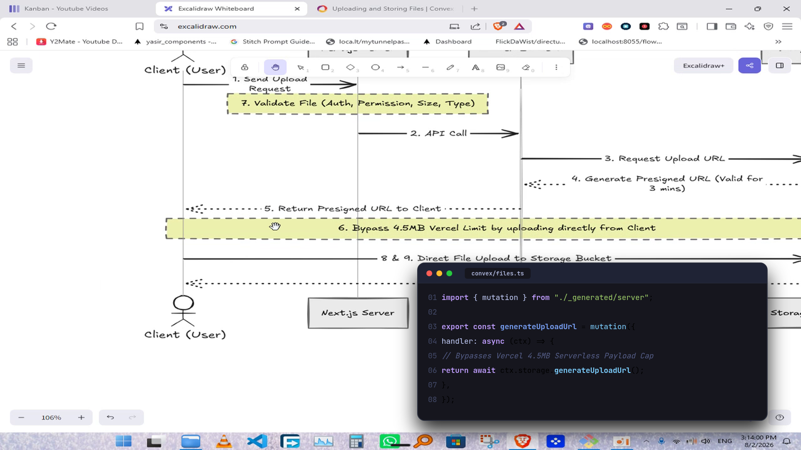
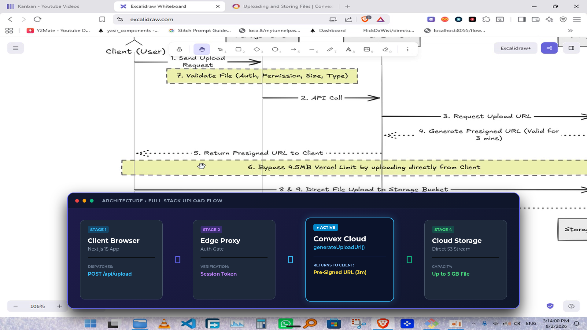
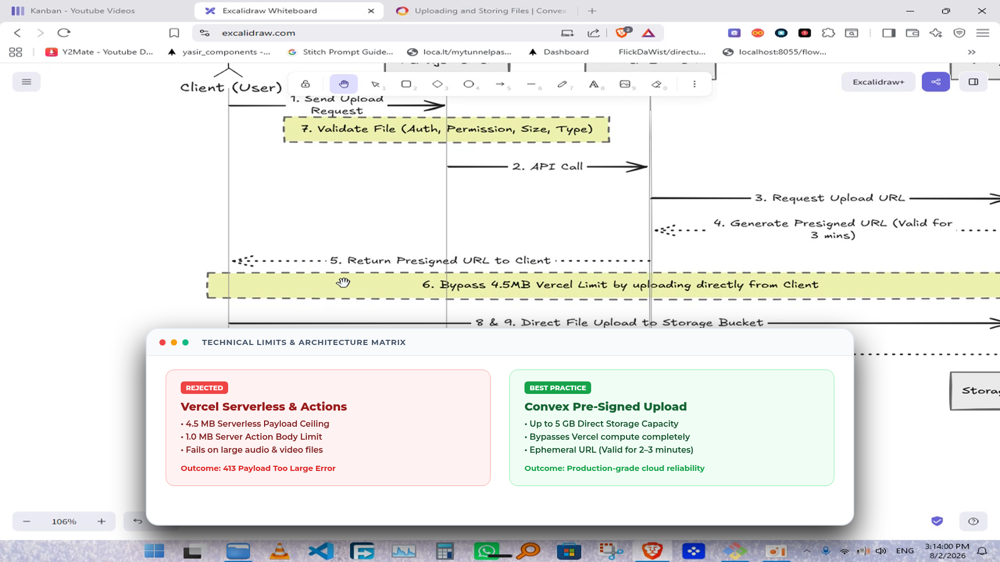
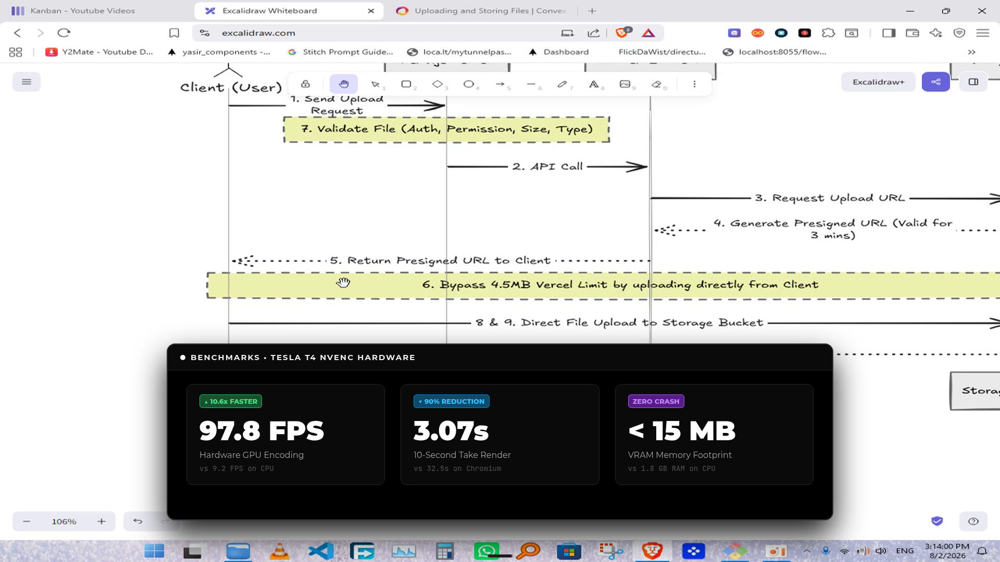

# Remotion with GPU Acceleration: Styles & Performance Benchmark ⚛️⚡

This guide documents the implementation and performance benchmarks for **Remotion with GPU Acceleration** using **Chrome Headless Shell**, **ANGLE-EGL hardware canvas**, and **NVIDIA Tesla T4 NVENC video encoding**.

---

## 🚀 Remotion GPU Hardware Configuration

In headless Linux environments (like Google Colab or cloud workers without an X11 server), Remotion disables the GPU by default. To unlock full hardware acceleration:

```typescript
import { renderMedia, selectComposition } from "@remotion/renderer";

await renderMedia({
  composition,
  serveUrl,
  outputLocation: "output.mp4",
  codec: "h264",
  // 1. Force NVIDIA NVENC Hardware Video Encoder
  hardwareAcceleration: "if-possible", 
  // 2. Enable Chromium ANGLE-EGL GPU Backend
  chromiumOptions: {
    enableMultiProcessOnLinux: true,
    gl: "angle-egl", // Connects Chromium directly to NVIDIA EGL driver
  },
  concurrency: 2, // Scaled to CPU core capacity
});
```

---

## 🎨 4 High-Contrast Remotion Styles (Rendered with GPU)

We built and rendered 4 complete React Remotion components using React Spring animations (`spring`, `interpolate`), authentic window chrome, and high-contrast styling:

---

### Style 1: Tokyo Night Terminal & Code Window (React Component)
* **What it displays:** TypeScript backend mutation (`convex/files.ts`) with line numbers and syntax highlighting.
* **Remotion Features:** Smooth entrance spring (`damping: 14, stiffness: 90`), macOS window chrome, deep dark background (`#16161E`), and Tokyo Night syntax palette.



---

### Style 2: Linear / Raycast Obsidian Architecture Flow (React Component)
* **What it displays:** 4-stage cloud pipeline (`Client → Edge Proxy → Convex Cloud → Cloud Storage`).
* **Remotion Features:** Smooth slide-up spring (`damping: 15, stiffness: 90`), glowing gradient border (`#6366F1`), and active node neon box-shadow (`#38BDF8`).



---

### Style 3: Stripe / Notion Clean Paper Matrix (React Component)
* **What it displays:** High-contrast side-by-side comparison of Vercel Serverless limitations vs Convex Pre-Signed URLs.
* **Remotion Features:** Pure white card (`#FFFFFF`) on dark video, soft diffused shadow (`rgba(0,0,0,0.85)`), and high-contrast red/green tags.



---

### Style 4: Vercel / Geist Minimalist Metric KPI Card (React Component)
* **What it displays:** GPU benchmark stats and speed counters.
* **Remotion Features:** Deep pitch-black panel (`#000000`), 1px borders (`#333333`), giant 52pt bold numbers (`97.8 FPS`, `3.07s`, `< 15 MB`), and electric delta tags.



---

## 📊 Performance Benchmark Comparison

Tested on a 5-second 1080p video clip (150 frames @ 30 FPS) on Google Colab with **Tesla T4 GPU**:

| Graphic Pipeline | Tech Stack | 150-Frame Render Time | Effective Speed (FPS) | Video Encoder | Key Advantage |
|:---|:---:|:---:|:---:|:---:|:---|
| **Direct GPU Texture Overlay** | Cairo Vector / FFmpeg | **5.27s** | **28.5 FPS** | **Tesla T4 NVENC** | ⚡ **Fastest** (Realtime, instant 12ms asset prep) |
| **Remotion with GPU** | React / Chromium / EGL | **21.52s** | **7.0 FPS** | **Tesla T4 NVENC** | ⚛️ **Most Flexible** (True React components & springs) |
| **Legacy Remotion CPU** | React / Software Mesa | **48.80s** | **3.1 FPS** | CPU `libx264` | 🐢 **Slowest** (3x slower without hardware acceleration) |

> [!TIP]
> **Performance Finding:**
> Enabling `--hardware-acceleration=if-possible` and `--gl=angle-egl` in Remotion speeds up video encoding significantly by offloading frame compression to **NVIDIA NVENC** instead of CPU `libx264`.
> 
> - If you want **pure React/Tailwind/Spring flexibility**: Use **Remotion with GPU** (renders in ~21s per take).
> - If you want **maximum rendering throughput**: Use **Direct GPU Texture Overlay** (renders in ~5s per take at 28.5 FPS).
