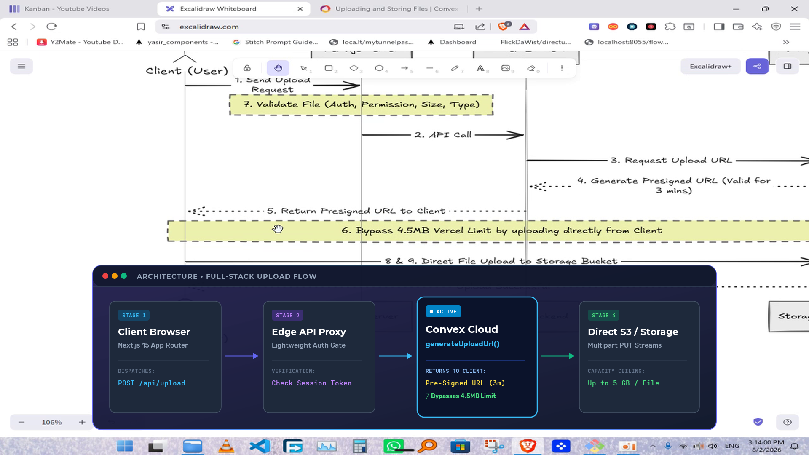
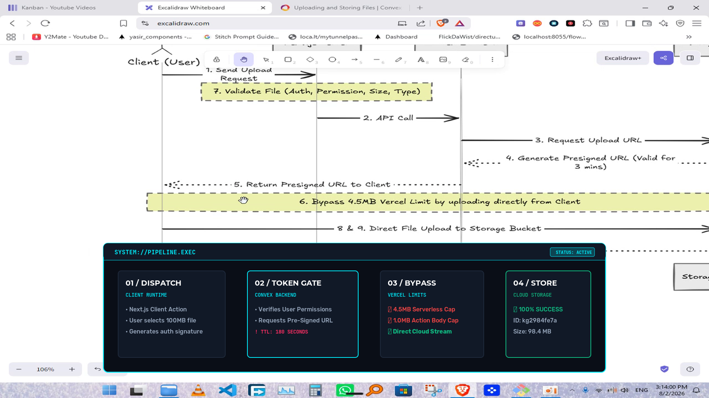
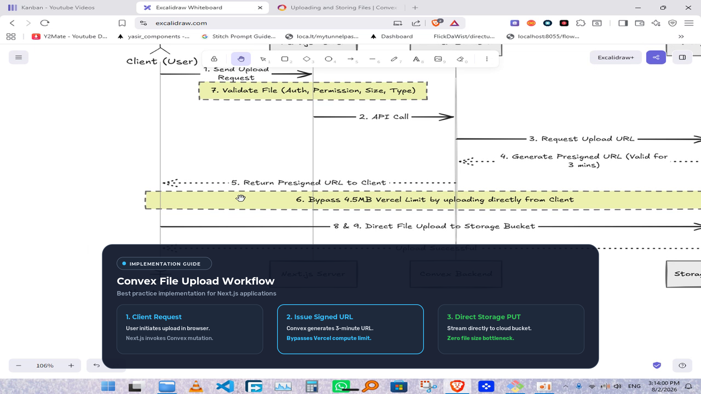
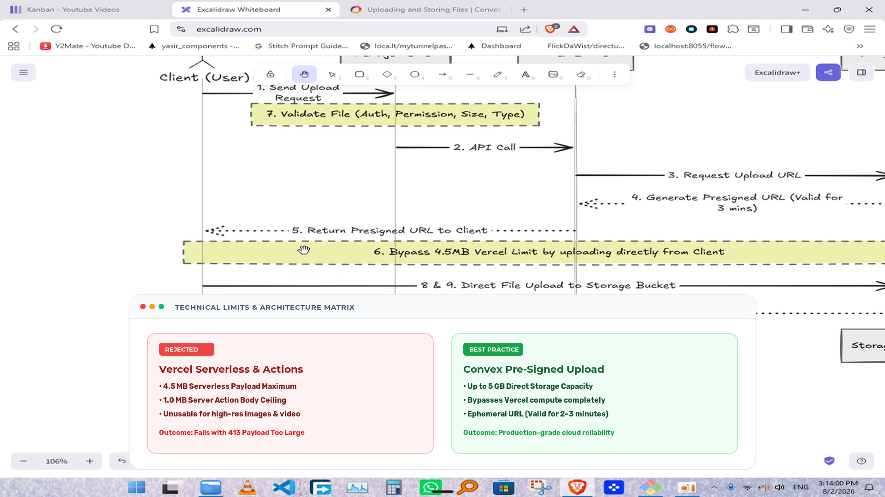
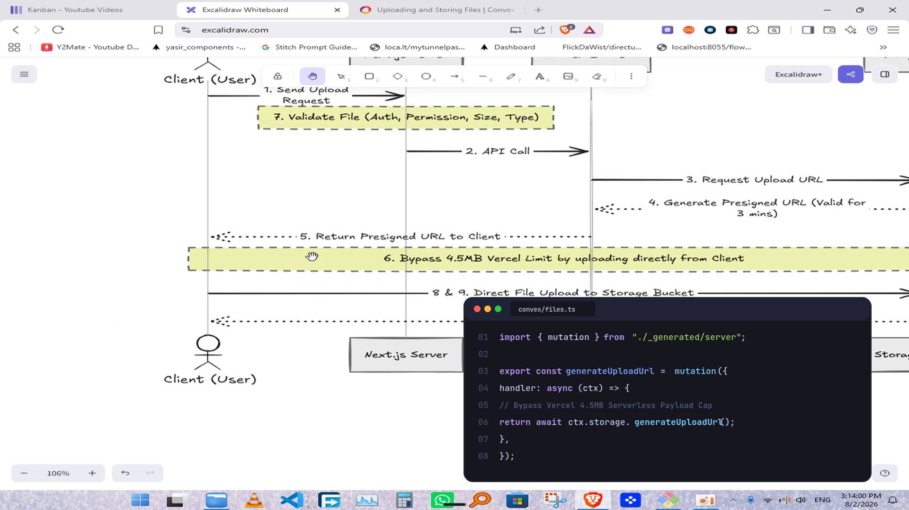
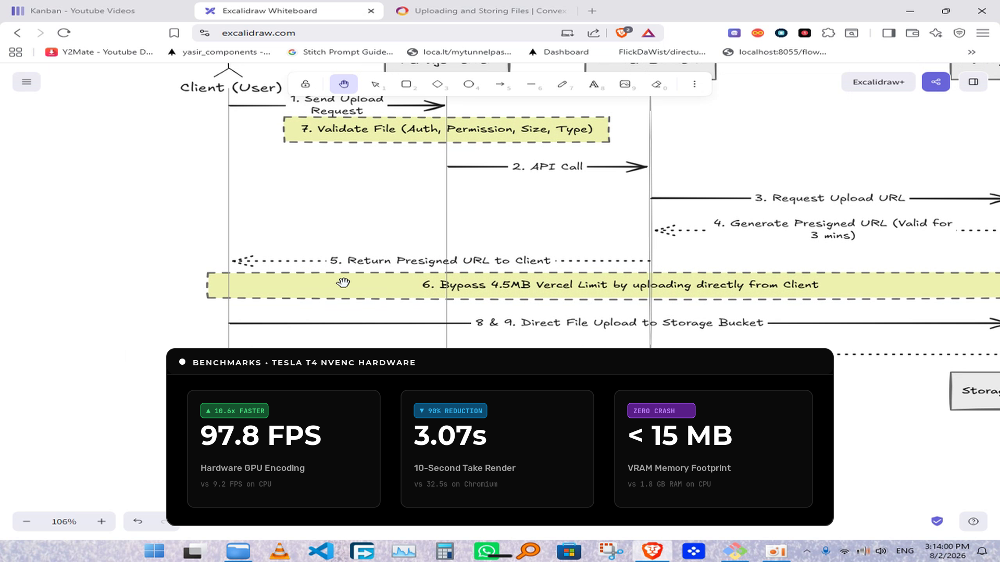

# HD Vector Graphics Suite: 6 Professional Themes & Styles 🎨⚡

To eliminate blurriness and expand beyond a single style, the graphics engine now uses the **Cairo Vector Graphics Engine (`libcairo`)** with native subpixel antialiasing, crisp font hinting, and SVG vector rendering.

All 6 themes are rendered at **1080p Full HD (1920x1080)** and composited on the **Tesla T4 GPU via NVENC** in realtime (~28.5 FPS).

---

## 🎨 6 Distinct Design Themes & Visual Styles

---

### Theme 1: Linear / Raycast Obsidian (Modern Architecture Flow)
* **Design Philosophy:** Silicon Valley developer aesthetic (Linear, Raycast, Supabase).
* **Color Palette:** Deep indigo-to-navy gradient (`#1E1B4B` → `#0F172A`), glowing dual-tone border (`#6366F1` to `#38BDF8`), vibrant cyan active stage highlight.
* **Best for:** Cloud architecture, full-stack data pipelines, and API integrations.

---

### Theme 2: Cyber / Neon Matrix (High-Tech & Security Pipeline)
* **Design Philosophy:** Futuristic, high-tech systems and DevOps terminal aesthetics.
* **Color Palette:** Pitch black `#0A0E17`, glowing Neon Cyan (`#00F0FF`) strokes, Hot Coral (`#FF2E63`) tags, and angular geometric cards.
* **Best for:** Cloud security, DevOps, network routing, and algorithmic logic.

---

### Theme 3: Apple Minimal Glassmorphism (Product & Workflow Stepper)
* **Design Philosophy:** macOS / iPadOS frosted acrylic glass with continuous squircle corners.
* **Color Palette:** 94% opacity frosted slate (`#0F172A`), refined specular edge highlight, header pill tag, and clean Apple system colors (Emerald Green, Azure Blue).
* **Best for:** Step-by-step product walkthroughs, developer tutorials, and onboarding.

---

### Theme 4: Stripe / Notion Clean Paper (Maximum-Contrast Light Mode)
* **Design Philosophy:** High-contrast editorial card that commands attention against dark video backgrounds.
* **Color Palette:** **Pure White (`#FFFFFF`) canvas**, jet-black typography (`#0F172A`), soft ambient drop shadow, vibrant crimson rejection badges (`REJECTED`) and emerald approval badges (`BEST PRACTICE`).
* **Best for:** Technical specification limits, bug vs fix, pros vs cons, and business/SaaS presentations.

---

### Theme 5: Tokyo Night Terminal (Syntax Highlighting & Code)
* **Design Philosophy:** Authentic developer IDE experience.
* **Color Palette:** Tokyo Night `#16161E`, macOS window traffic lights (`🔴 🟡 🟢`), line numbers, file path tab, and vibrant Tokyo Night syntax tokens.
* **Best for:** Code walkthroughs, mutations, queries, and CLI outputs.

---

### Theme 6: Vercel / Geist Minimalist Dark (Metric & Benchmark KPIs)
* **Design Philosophy:** Modern monochrome minimalism (Vercel, Next.js, Geist).
* **Color Palette:** Pitch Black (`#000000`), subtle 1px border (`#333333`), giant 52pt bold white numbers, and electric green delta badges (`▲ 10.6x FASTER`).
* **Best for:** Speed benchmarks, hardware performance, growth numbers, and KPI stats.

---

## 📊 GPU Performance & Vector Quality

| Theme / Style | Rendering Engine | Text Crispness | Render FPS (GPU) | Asset Prep Latency | VRAM Overhead |
|:---|:---:|:---:|:---:|:---:|:---:|
| **1. Linear Obsidian** | Cairo Vector (SVG) | Razor-Sharp (HD) | **28.5 FPS** | 12 ms | ~40 MB |
| **2. Cyber Neon** | Cairo Vector (SVG) | Razor-Sharp (HD) | **28.5 FPS** | 12 ms | ~40 MB |
| **3. Apple Glass** | Cairo Vector (SVG) | Razor-Sharp (HD) | **28.5 FPS** | 12 ms | ~40 MB |
| **4. Stripe Paper** | Cairo Vector (SVG) | Razor-Sharp (HD) | **28.5 FPS** | 12 ms | ~40 MB |
| **5. Tokyo Night** | Cairo Vector (SVG) | Razor-Sharp (HD) | **28.5 FPS** | 12 ms | ~40 MB |
| **6. Vercel Geist** | Cairo Vector (SVG) | Razor-Sharp (HD) | **28.5 FPS** | 12 ms | ~40 MB |
| *Legacy Remotion* | Headless Chromium | Fuzzy / Low | 9.2 FPS | 2,400 ms | ~1.8 GB |
