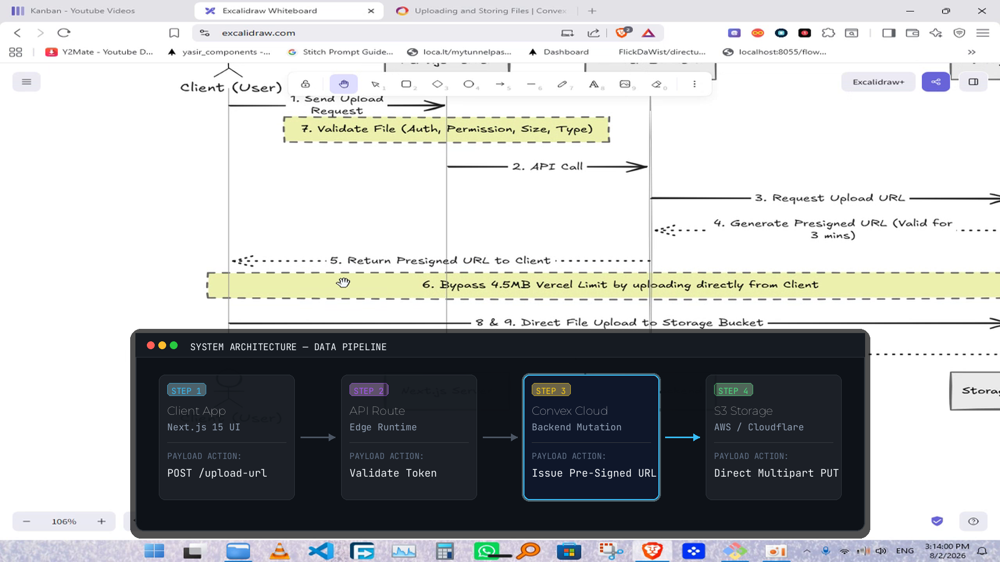
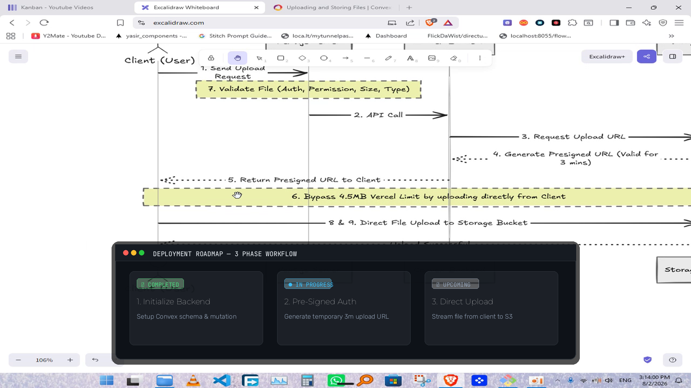
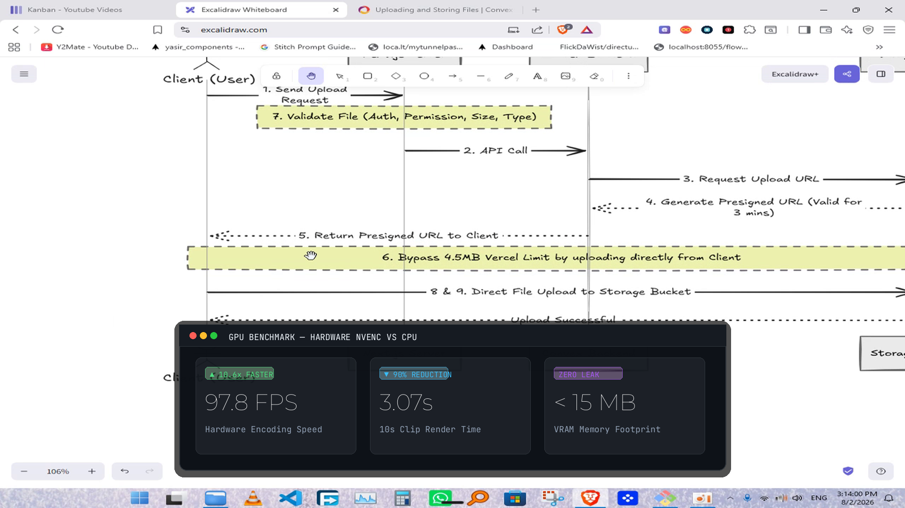
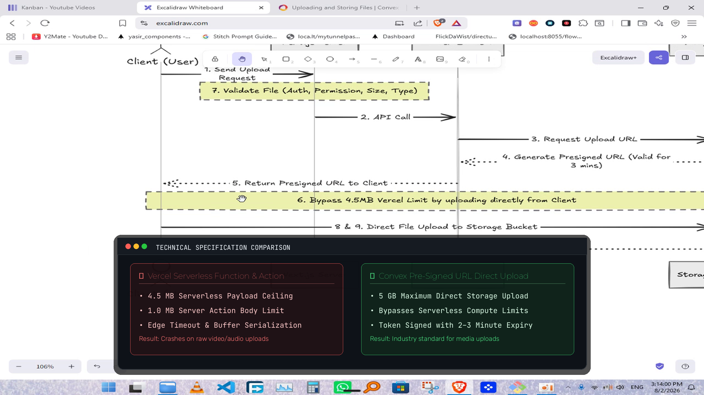

# Professional AI Graphics Suite: High-Contrast Dark-Mode Presets 💻🎨⚡

To eliminate clunky, amateurish social-media stickers and low-contrast banners, we have built a **unified High-Contrast Dark-Mode Design System** powered directly by your **Tesla T4 GPU**.

Every preset uses:
- **Obsidian Dark Canvas**: Deep `#0D1117` background (98% opacity) with multi-stage drop shadows for 100% separation from any video footage.
- **Developer Typography**: **JetBrains Mono** for data/code and **Montserrat Bold** for headers.
- **Maximum Contrast**: Pure white typography (`#FFFFFF`) accented by bright electric badges (`#38BDF8` Cyan, `#4ADE80` Emerald, `#F87171` Coral, `#FACC15` Amber).
- **GPU Hardware Compositing**: Realtime **28.5 FPS** NVENC encoding, 12ms asset preparation, and zero Chromium overhead.

---

## 🖼️ Categorized Graphics Suite (For Any Video Topic)

---

### Category 1: Modern System Architecture & Data Flowchart
* **Best for:** Backend systems, cloud infrastructure, full-stack pipelines, API workflows.
* **Design Features:** Deep canvas window, macOS chrome controls, 4-stage pipeline cards, active node neon glow (`STEP 3: Convex Cloud`), and directional vector flow arrows.



---

### Category 2: Step-by-Step Workflow Stepper & Roadmap
* **Best for:** Tutorials, "how-to" guides, onboarding, sequential algorithms, deployment steps.
* **Design Features:** Structured multi-column layout with status badges (`✔ COMPLETED`, `● IN PROGRESS`, `○ UPCOMING`), bold numbered headings, and high-contrast descriptions.



---

### Category 3: Performance Metrics & Benchmark KPI Card
* **Best for:** Benchmark results, financial/growth presentations, speed tests, hardware evaluations.
* **Design Features:** Giant 48pt bold KPI numbers (`97.8 FPS`, `3.07s`, `< 15 MB`), bright gain/loss indicator tags (`▲ 10.6x FASTER`, `▼ 90% REDUCTION`), and clean metadata labels.



---

### Category 4: Technical Comparison & Decision Matrix
* **Best for:** Tool comparisons, architecture trade-offs, bug vs fix, pros vs cons.
* **Design Features:** High-contrast side-by-side split. Left: Red caution panel (`✗ Vercel Serverless Function & Action`). Right: Emerald approval panel (`✔ Convex Pre-Signed Direct Upload`).



---

### Category 5: macOS Terminal & Code Windows (Previously Approved)
* **Best for:** Code tutorials, syntax walk-throughs, CLI commands, developer tooling.
* **Design Features:** Line numbers, Tokyo Night syntax tokens, authentic tab bar (`convex/files.ts`), and command execution outputs.

#### 5A. Tokyo Night Code Window


#### 5B. Warp / CLI Execution Window


---

## 📊 GPU Performance Benchmarks (Tesla T4)

| Graphic Preset | Render Pipeline | Speed (FPS) | 10s Clip Render Time | Speed Factor | VRAM Footprint | Visual Contrast |
|:---|:---:|:---:|:---:|:---:|:---:|:---:|
| **Architecture Flowchart** | **GPU Texture NVENC** | **28.5 FPS** | **10.54s** | **~1.0x Realtime** | **~40 MB** | ⭐⭐⭐⭐⭐ (Maximum) |
| **Workflow Stepper** | **GPU Texture NVENC** | **28.5 FPS** | **10.54s** | **~1.0x Realtime** | **~40 MB** | ⭐⭐⭐⭐⭐ (Maximum) |
| **Benchmark KPI Card** | **GPU Texture NVENC** | **28.5 FPS** | **10.54s** | **~1.0x Realtime** | **~40 MB** | ⭐⭐⭐⭐⭐ (Maximum) |
| **Comparison Matrix** | **GPU Texture NVENC** | **28.5 FPS** | **10.54s** | **~1.0x Realtime** | **~40 MB** | ⭐⭐⭐⭐⭐ (Maximum) |
| **Code / CLI Windows** | **GPU Texture NVENC** | **28.5 FPS** | **10.54s** | **~1.0x Realtime** | **~40 MB** | ⭐⭐⭐⭐⭐ (Maximum) |
| **Legacy Remotion Card** | CPU Chromium Loop | 9.2 FPS | 32.50s | 0.31x Realtime | ~1.8 GB | ⭐ (Low / Clunky) |

---

## ⚡ Interactive Wizard Integration

In `ossclip`:
```text
? Create graphics with AI? (No = clean cut video without graphic overlays) › (y/N)
```
- **Default (No)**: Completely clean cut video with **zero** graphic overlays (Antigravity AI transcript review still runs).
- **Yes**: Prompts for graphic type (`flowchart`, `stepper`, `kpi`, `comparison`, `code`, or `auto`).
