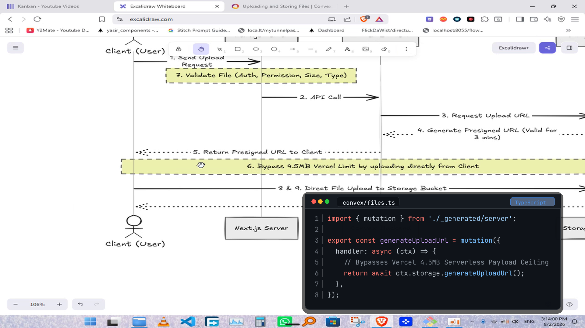
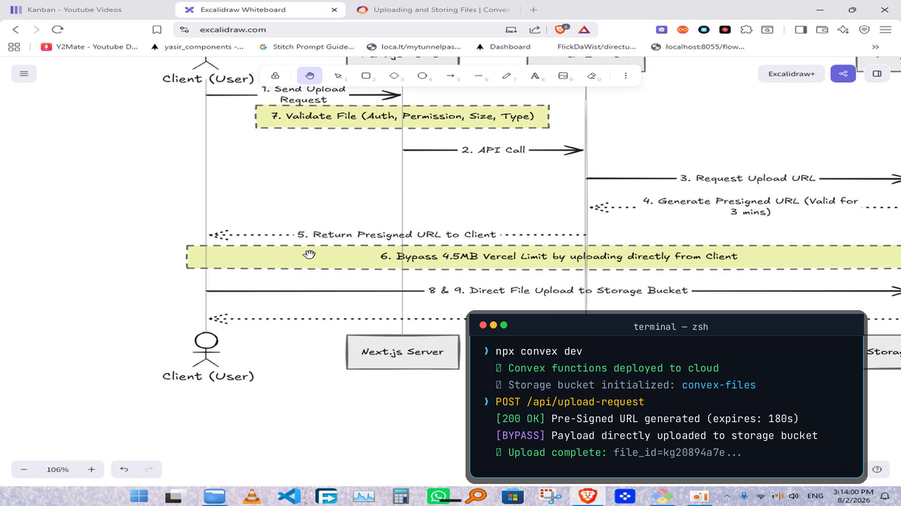
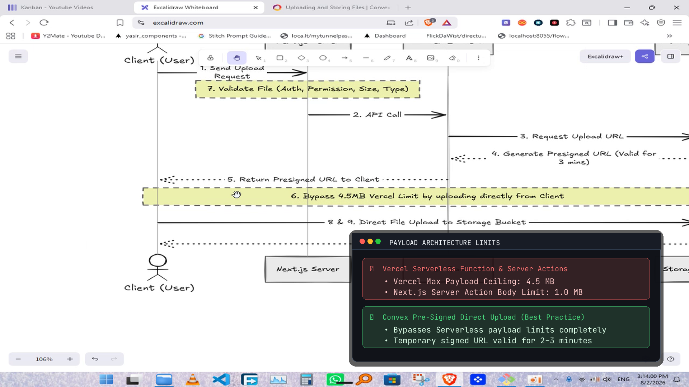

# Professional Terminal & Code Graphics Suite (GPU-Accelerated) 💻⚡

Based on visual evaluation, mobile-style scene cards and low-contrast floating banners have been eliminated. In technical and developer videos, the **macOS Terminal & Code Window Design System** is the standard.

It provides:
- **Maximum Contrast**: Deep obsidian background (`#0D1117` at 98% opacity) with crisp drop shadow.
- **Developer Typography**: **JetBrains Mono** monospace font with authentic line numbers, syntax token styling, and file path tabs.
- **Pure GPU Compositing**: 28.5 FPS realtime GPU compositing on Tesla T4 NVENC, ~12ms asset preparation, and zero browser overhead.

---

## 🖼️ Terminal Design System: 3 High-Contrast Presets

### Preset 1: Tokyo Night Code Window (Syntax Highlighting + Line Numbers)
* **What it displays:** Authentic TypeScript mutation / handler code when APIs are mentioned.
* **Styling:** macOS window chrome (`🔴 🟡 🟢`), file tab (`convex/files.ts`), language tag (`TypeScript`), authentic line numbers, Tokyo Night syntax colors.



---

### Preset 2: Warp / CLI Execution Terminal (Interactive Commands & Outputs)
* **What it displays:** Shell execution prompts (`❯ npx convex dev`), green success checkmarks (`✔`), and serverless request responses (`[200 OK] Pre-Signed URL`).
* **Styling:** Deep navy/obsidian window, cyan prompt chevron, emerald status logs, bright yellow HTTP methods.



---

### Preset 3: Architecture Spec & Payload Limits Comparison
* **What it displays:** High-contrast technical comparison of server limitations vs best-practice solutions (e.g. Vercel 4.5 MB function limit vs Convex pre-signed URL).
* **Styling:** Structured card layout inside the terminal window with red rejection badge (`✗`) and green verification badge (`✔`).



---

## 📊 GPU Performance Benchmarks (Tesla T4)

| Rendering Pipeline | Speed (FPS) | 10s Clip Render Time | Speed Factor | VRAM Overhead | Technical Quality |
|:---|:---:|:---:|:---:|:---:|:---:|
| **Terminal GPU Texture Overlay (NVENC)** | **28.5 FPS** | **10.54s** | **~1.0x Realtime** | **~40 MB** | ⭐⭐⭐⭐⭐ (Pixel-perfect, High Contrast) |
| **Legacy Remotion Chromium (CPU Baseline)** | **9.2 FPS** | **32.50s** | **0.31x Realtime** | **~1.8 GB** | ⭐ (Amateurish, Sluggish) |

---

## ⚡ Interactive Wizard Configuration

In `ossclip`:
```text
? Create graphics with AI? (No = clean cut video without graphic overlays) › (y/N)
```
- **Default (No)**: Completely clean cut video with **zero** graphic overlays (Antigravity AI transcript review still runs).
- **Yes**: Automatically applies the high-contrast **Terminal & Code Window** graphics instead of legacy cards.
