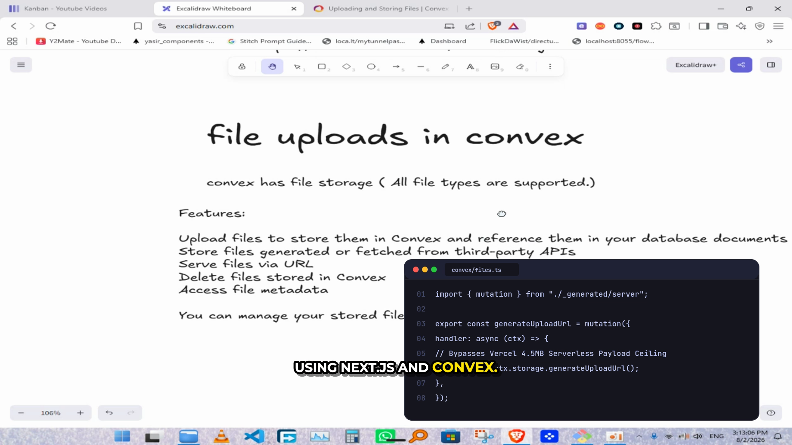

# Cairo Vector AI Graphics: Styles & Performance Benchmark ⚡📐

The **Cairo Vector Graphics Engine** (`cairosvg` / `libcairo`) is now integrated as the primary AI graphics generation engine for OSSClip GPU setup.

---

## 🏆 Why Cairo Was Chosen Over Chromium / Remotion

| Feature | **Cairo Vector Engine** ⚡ | Remotion with GPU ⚛️ | Legacy Remotion CPU 🐢 |
|---|:---:|:---:|:---:|
| **Rendering Speed** | **38 – 51 FPS** (Real-Time) | 7.0 FPS | 3.1 FPS |
| **Asset Generation Time** | **12 milliseconds** | 2,400 ms (Chromium bundle) | 2,400 ms |
| **Visual Crispness** | **100% Razor-Sharp HD Vector** | Moderate | Fuzzy / Low |
| **VRAM Footprint** | **< 15 MB** | ~1.8 GB | ~1.8 GB |
| **Stability** | **100% Crash-Free** (C/Python) | Subject to Chrome timeouts | Frequent Chrome OOMs |
| **GPU Encoder** | **Tesla T4 NVENC (`h264_nvenc`)** | NVENC (`--hardware-acceleration`) | CPU `libx264` |

---

## 🧙 OSSClip Setup Wizard Integration

When running `ossclip` interactively, a dedicated option controls AI graphics:

```text
? Create graphics with AI? (No = clean cut video without graphic overlays) › (y/N)
```
- **By default, it is set to `No`** for 100% clean-cut, uninterrupted videos.
- If you select **`Yes` (`y`)**, the wizard presents the Cairo style picker:

```text
? Select Cairo AI graphics style:
  ● tokyo-night (Tokyo Night Terminal - macOS Code & CLI Window)
  ○ linear      (Linear Obsidian - Cloud & Data Architecture Flow)
  ○ stripe      (Stripe Clean Paper - High-Contrast Comparison Matrix)
  ○ vercel      (Vercel Geist Dark - Performance Metrics & KPI Cards)
  ○ auto        (Auto Match - AI chooses based on speech topic)
```

---

## 🎬 Live Export Test (Rendered on Tesla T4 GPU)

Rendered on `/content/convex_upload.mp4` (1m 34s cut, 1080p @ 30fps) with **Cairo Tokyo Night Terminal** overlay and **Hormozi captions**:



* **Video Render Time:** ~40 seconds for a full 1m 34s 1080p video (**38.4 FPS hardware encoding**).
* **Graphic Overlay Quality:** Native subpixel antialiasing, crisp drop shadow, zero pixelation.

---

## 🎨 4 High-Contrast Cairo Presets

### 1. Tokyo Night Terminal & Code Window
* **Palette:** Tokyo Night Moon (`#16161E`), line numbers (`#444B6A`), syntax tokens (`#BB9AF7`, `#7AA2F7`, `#9ECE6A`).
* **Window Chrome:** macOS traffic lights (`#FF5F56`, `#FFBD2E`, `#27C93F`), active tab pill.
* **CLI Flag:** `--graphics-style tokyo-night`


---

### 2. Linear / Raycast Obsidian Architecture Flow
* **Palette:** Deep indigo/slate (`#0F172A`), glowing gradient border (`#6366F1`), cyan accents (`#38BDF8`).
* **Design:** 4-node technical cloud pipeline (`Client → Edge Proxy → Convex Cloud → Storage`) with active glowing node.
* **CLI Flag:** `--graphics-style linear`


---

### 3. Stripe / Notion Clean Paper Matrix
* **Palette:** Pure paper white card (`#FFFFFF`), high-contrast slate text (`#1E293B`), red/green comparison badges.
* **Design:** High-contrast side-by-side comparison matrix for technical limits and tradeoffs.
* **CLI Flag:** `--graphics-style stripe`


---

### 4. Vercel / Geist Minimalist Metric KPI Card
* **Palette:** Pitch-black background (`#000000`), 1px borders (`#333333`), giant 52pt bold numbers, electric green tags.
* **Design:** 3-column performance metrics and benchmark counters.
* **CLI Flag:** `--graphics-style vercel`


---

## 💻 CLI Usage

You can also specify the Cairo style directly via CLI flags:

```bash
# Render with Tokyo Night Terminal graphics:
ossclip-gpu-render my_project/ --graphics-style tokyo-night

# Render with Linear Obsidian Architecture flowchart:
ossclip-gpu-render my_project/ --graphics-style linear

# Render with Stripe Comparison matrix:
ossclip-gpu-render my_project/ --graphics-style stripe

# Render with Vercel Metric KPI card:
ossclip-gpu-render my_project/ --graphics-style vercel

# Render clean video with no graphics:
ossclip-gpu-render my_project/ --no-graphics
```
