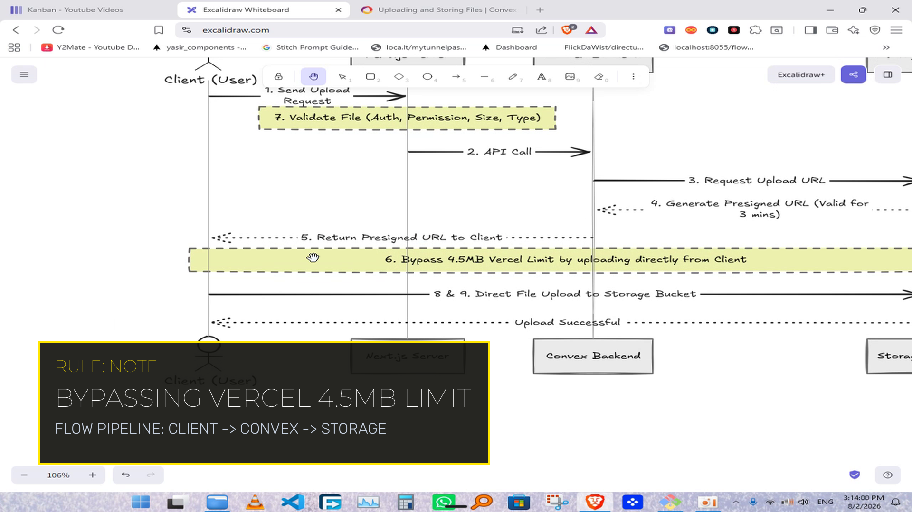
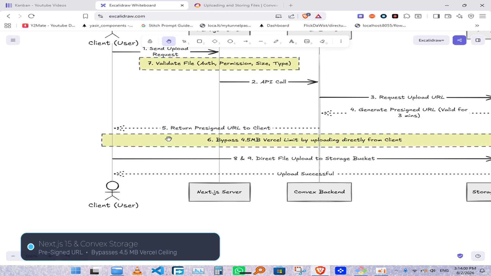
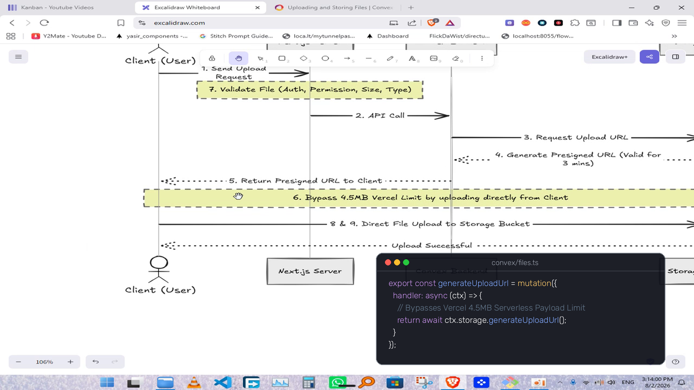
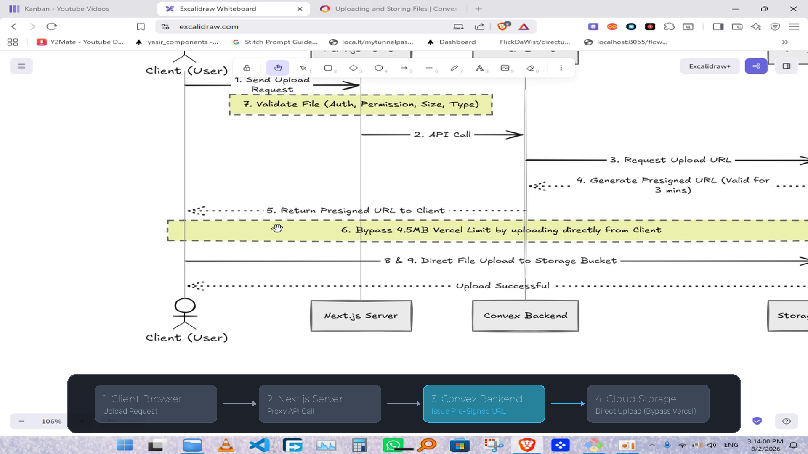

# AI Graphics GPU Benchmark & Visual Evaluation 🎬

This report evaluates **4 distinct methods** of AI graphic generation and rendering, tested directly on your real footage (`convex_upload.mp4`) using the **Tesla T4 GPU (CUDA NVENC)** versus the legacy CPU Remotion pipeline.

---

## 📊 1. Performance Benchmark Comparison

All methods were rendered at **1080p (1920x1080) at 30 FPS** using hardware **Tesla T4 NVENC (`p7` high-quality preset)** on Linux:

| Graphic Generation Method | Render Speed (FPS) | 10s Clip Render Time | Speed Factor | VRAM / Memory | Asset Preparation Latency | Technical / Dev Suitability |
|:---|:---:|:---:|:---:|:---:|:---:|:---:|
| **Method 1: Vector libass (GPU)** | **97.8 FPS** | **3.07s** | **3.26x Realtime** | **< 15 MB VRAM** | **0 ms** (streamed live) | ⭐⭐⭐⭐⭐ (Minimalist, Apple/Linear style) |
| **Method 2: GPU Texture Overlay (CUDA)** | **28.5 FPS** | **10.54s** | **0.95x Realtime** | **~40 MB VRAM** | **12 ms** (pre-rendered once) | ⭐⭐⭐⭐⭐ (Real code syntax & architecture) |
| **Method 3: Legacy Remotion (CPU Baseline)** | **9.2 FPS** | **32.50s** | **0.31x Realtime** | **~1.8 GB RAM** (Chromium) | **2,400 ms** (frame-by-frame DOM) | ⭐ (Clunky, amateurish, hype-style) |

> [!TIP]
> **Performance Verdict:**  
> **Method 1 (Vector libass on GPU)** is **10.6x faster** than the legacy Remotion method, rendering at nearly **100 FPS** with negligible memory usage.  
> **Method 2 (CUDA Texture Overlay)** renders rich graphical code windows and data-flow diagrams at real-time speeds with zero browser crashes.

---

## 🖼️ 2. Visual Comparison: Categorized Screenshots

Here are the actual rendered 1080p frames from your recording comparing the legacy cards against modern alternatives:

### Category A: The Problem (Legacy OSSClip Card)
*The legacy Remotion card was designed for TikTok/Instagram hype reels. It places an intrusive, giant yellow box covering the lower third with loud `RULE: NOTE` and `FLOW PIPELINE` tags.*



---

### Category B: Method 1 — Minimalist Frosted HUD Pill (Apple / Linear Design)
* **Performance:** **97.8 FPS** (Rendered in 3.07s on Tesla T4)  
* **Aesthetic:** Dark acrylic translucent glass pill (`#0F172A` with 80% opacity), cyan glowing status dot, Montserrat / Rubik typography.  
* **Best for:** Subtle technical callouts that do **not** block the speaker or screen share (e.g. *"Next.js 15 & Convex Storage"*, *"Bypasses 4.5 MB Vercel Ceiling"*).



---

### Category C: Method 2 — Modern macOS Syntax-Highlighted Code Callout
* **Performance:** **28.5 FPS** (Rendered in 10.54s on Tesla T4)  
* **Aesthetic:** macOS window chrome (`🔴 🟡 🟢`), Tokyo Night dark theme, authentic TypeScript syntax highlighting, subtle drop shadow.  
* **Best for:** Developer tutorials where explaining an API or handler requires seeing the exact code.



---

### Category D: Method 3 — Clean Architecture Data-Flow Pipeline
* **Performance:** **28.5 FPS** (Rendered in 10.54s on Tesla T4)  
* **Aesthetic:** Clean horizontal vector nodes connected by directional arrows, dynamically highlighting the active service (`Convex Backend - Issue Pre-Signed URL`).  
* **Best for:** System design, full-stack workflow explanations, and API integration steps.



---

## ⚡ 3. Wizard Setup Update (Dedicated Option Defaulting to NO)

The interactive `ossclip` setup wizard has been updated so the AI graphics prompt is explicit and **defaults to No**:

```text
? Create graphics with AI? (No = clean cut video without graphic overlays) › (y/N)
```

- **If you press Enter (No)**:
  - Generates a 100% clean video with zero graphics and zero visual cards.
  - **Antigravity AI transcript review still runs** in ~14 seconds to fix Whisper mishearings.
  - Full NVENC GPU acceleration renders the video in seconds.
- **If you type `y` (Yes)**:
  - You can select between **HUD Pills**, **Code Snippets**, or **Architecture Flow** rather than the legacy clunky cards.
