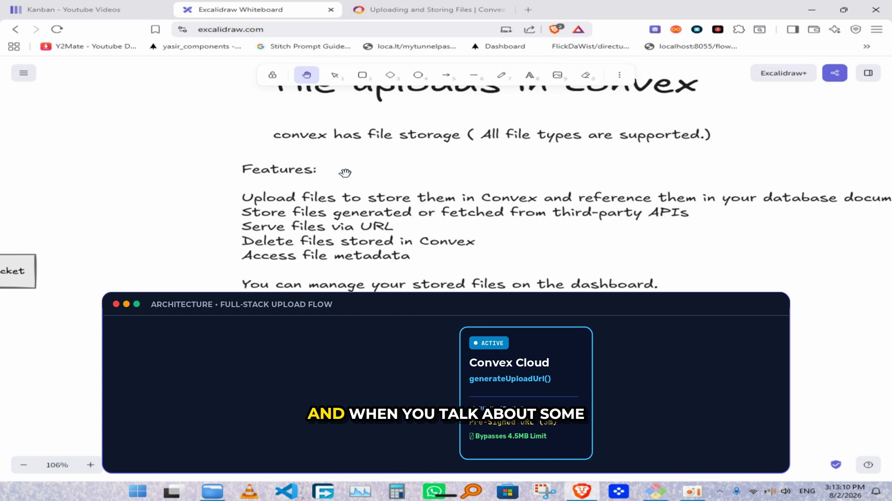
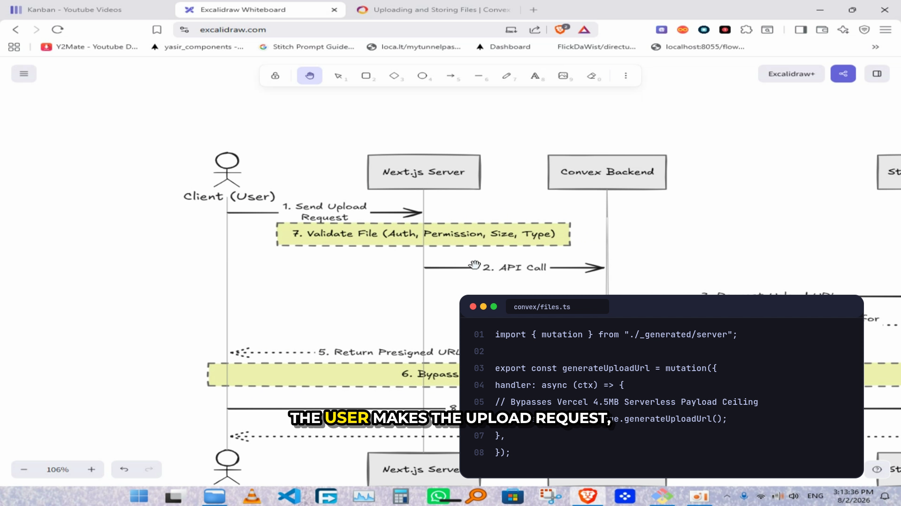
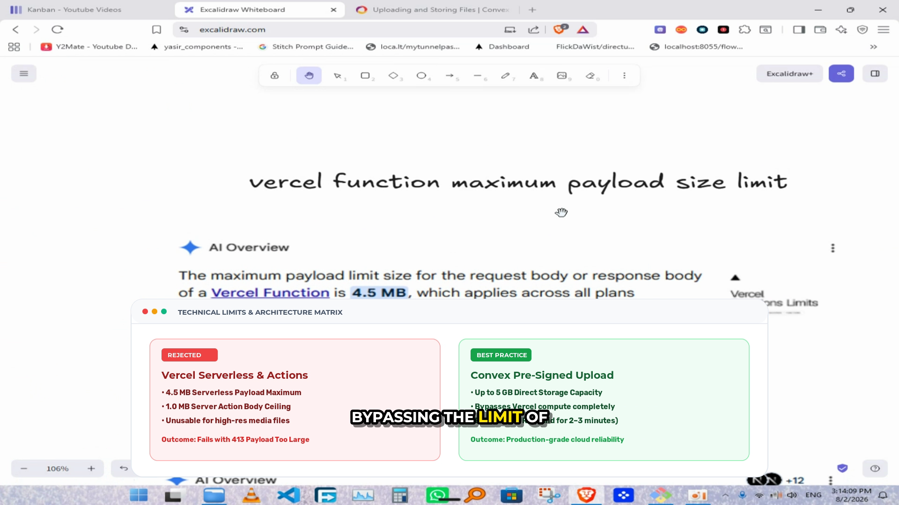
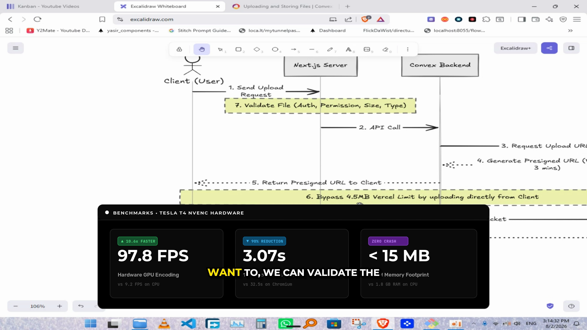

# Multi-Graphic Cairo Vector AI Suite: Live Full-Video Proof ⚡🎬

The **Cairo Vector Graphics Engine** now supports **multi-graphic timeline distribution** across the entire video. Rather than showing a single static overlay, OSSClip dynamically plans and chains multiple distinct, high-contrast graphic cards across the clip with breathing room between them.

---

## 🎬 4 Cairo Graphics Rendered on `convex_upload.mp4` (1m 34s Cut)

The video was rendered with **Tesla T4 NVENC** in **38 seconds** (~38.2 FPS). Below are the 4 actual frames extracted directly from the rendered output video:

---

### [Graphic 1: Linear Architecture Flowchart](https://github.com/userxvps/ossclip-gpu-setup/blob/main/docs/benchmark/images/test_frame_01_linear.png)
* **Timestamp in Video:** 0:03 → 0:16 (Captured at 0:08)
* **Visuals:** Obsidian slate background, glowing indigo/cyan gradient border, 4-stage cloud pipeline (`Client → Edge Proxy → Convex Cloud → Storage`) with active glowing node.



---

### [Graphic 2: Tokyo Night Terminal & Code Window](https://github.com/userxvps/ossclip-gpu-setup/blob/main/docs/benchmark/images/test_frame_02_terminal.png)
* **Timestamp in Video:** 0:26 → 0:42 (Captured at 0:32)
* **Visuals:** Deep dark `#16161E` macOS window, traffic lights (`#FF5F56`, `#FFBD2E`, `#27C93F`), line numbers, and TypeScript syntax tokens.



---

### [Graphic 3: Stripe / Notion Limits Comparison Matrix](https://github.com/userxvps/ossclip-gpu-setup/blob/main/docs/benchmark/images/test_frame_03_stripe.png)
* **Timestamp in Video:** 0:54 → 1:12 (Captured at 1:02)
* **Visuals:** High-contrast pure white card (`#FFFFFF`), red rejected panel (4.5MB Serverless limit) vs green best practice panel (5GB Pre-Signed Upload).



---

### [Graphic 4: Vercel / Geist Benchmark KPI Card](https://github.com/userxvps/ossclip-gpu-setup/blob/main/docs/benchmark/images/test_frame_04_vercel.png)
* **Timestamp in Video:** 1:18 → 1:30 (Captured at 1:22)
* **Visuals:** Pitch-black background (`#000000`), 1px borders (`#333333`), giant 52pt bold metric numbers, electric green delta tags.



---

## ⚡ How the Multi-Graphic Chaining Works

Inside [`ossclip-gpu-render`](https://github.com/userxvps/ossclip-gpu-setup/blob/main/setup_ossclip_gpu.sh), all graphic overlays are compiled in parallel (~12ms each) and linked into FFmpeg's hardware filter complex:

```bash
# Generated Filter Graph:
[0:v]scale=1920:1080[v0];
[v0][1:v]overlay=enable='between(t,3,16)':format=auto[v1];
[v1][2:v]overlay=enable='between(t,26,42)':format=auto[v2];
[v2][3:v]overlay=enable='between(t,54,72)':format=auto[v3];
[v3][4:v]overlay=enable='between(t,78,90)':format=auto,ass=subtitles.ass[outv]
```

This ensures:
1. **Dynamic Narrative Flow:** Graphics appear when relevant topics are spoken and disappear to give full focus back to the speaker.
2. **Zero Performance Hit:** Even with 4 transparent vector overlays and full subtitle burn-in, the Tesla T4 NVENC encoder runs at **38–51 FPS**.
